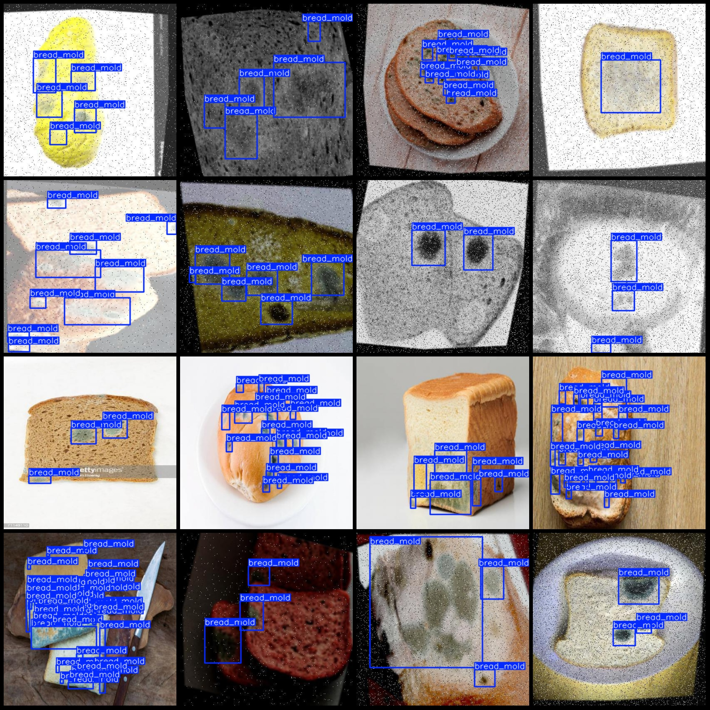
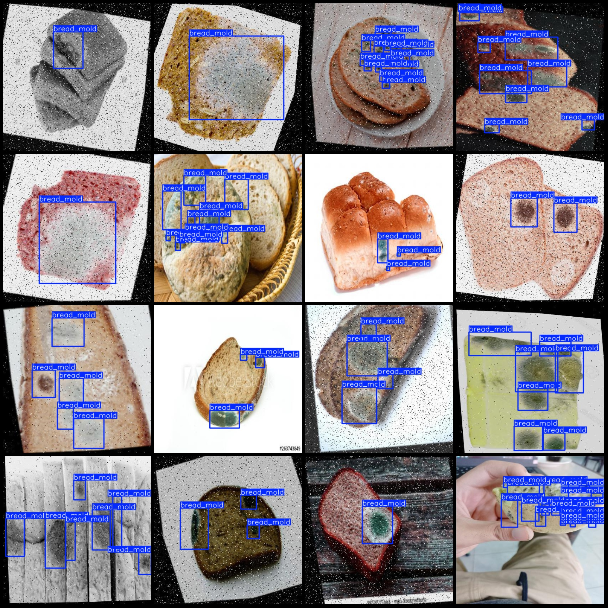

# Bread Mold Deterioration Detection Dataset in Pascal VOC+YOLO Format with 174 Images and 1 Label

Dataset format: Pascal VOC format + YOLO format (txt file without split path, only containing jpg images and corresponding VOC format xml files and yolo format txt files).
Number of images (jpg file count): 174
Number of labeled images (xml file count): 174
Number of labeled images (txt file count): 174
Number of labeled categories: 1
Labeled category name: ["bread_mold"]
Each category has a box count:  
bread_mold box count = 1043
Total boxes count: 1043
Number of images each category occupies:  
bread_mold occupies 174
Image resolution: 416x416
Using labeling tool: labelImg
Labeling rule: Draw bounding boxes for the categories
Important note: The dataset does not have been divided into training, validation, or test sets; you need to divide it yourself.
Special declaration: This dataset does not guarantee the accuracy of the trained models or weight files.
Preview of images:
Example of labeled images:

## Images

Here is a pay link on Stripe ( https://buy.stripe.com/3cs8yP7sY87d0vu9AB ). Please contact me lonlonago@foxmail.com after funding $89, and I will send you a complete data files , thank you!

